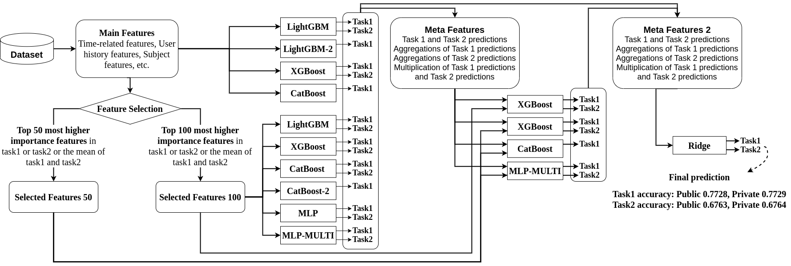

# Solution of NeurIPS-Education-Challenge-2020

This repository is the code for task 1 and task 2 solutions of The NeurIPS 2020 Education Challenge.
The Task 3 code is located [here](https://github.com/haradai1262/NeurIPS-Education-Challenge-2020/tree/main/task3)

## Competition results

- Task 1 (Predict Student Responses – Right or Wrong) - 1st place
- Task 2 (Predict Student Responses – Answer Prediction) - 2nd place
- Task 3 (Global Question Quality Assessment) - 1st place (In this task there was a four-way tie.)
- Conbined - 1st place

competition website: https://eedi.com/projects/neurips-education-challenge

## Overview



## Usage

### Download dataset

- register codelab and join "Diagnostic Questions - The NeurIPS 2020 Education Challenge"
  - https://competitions.codalab.org/competitions/25449
- download data (https://competitions.codalab.org/competitions/25449#participate)

### Run

```
$ cd ./run
$ sh solution.sh
```

## Folder structure

```
NeurIPS-Education-Challenge-2020

├── exp # deploy the experiment's config
     └── (experiment name)
             └── config.py

├── features # save extracted feature files
     └── (feature_name).feather

├── folds # save cross validation data table files
     └── (folds_name).csv

├── data
     └── trian_data
          └── train_task_1_2.csv
     └── metadata
          └── answer_metadata_task_1_2.csv
          └── question_metadata_task_1_2.csv
          └── student_metadata_task_1_2.csv

├── run
     └── solution.sh

├── save # save experimental result files
     └── (experiment name)/   
          └── model_log/
          └── model_weight/
          └── preds_val_task1_{run_id}.csv
          └── preds_test_task1_{run_id}.csv

├── src
     └── create_folds.py
     └── dataset.py
     └── feature_extraction.py
     └── model.py
     └── train_5fold.py
     └── utils.py
     └── utils_feature.py
     └── utils_model.py

├── submission # save submission files
     └── (experiment name)/
          └── submission_task1__auc{local auc}__acc{local acc}_th{selected threshold value}.zip
          └── submission_task2__acc{local acc}.zip
```

## Contact

- Email: daichi.takehara0730@gmail.com (Daichi Takehara)
